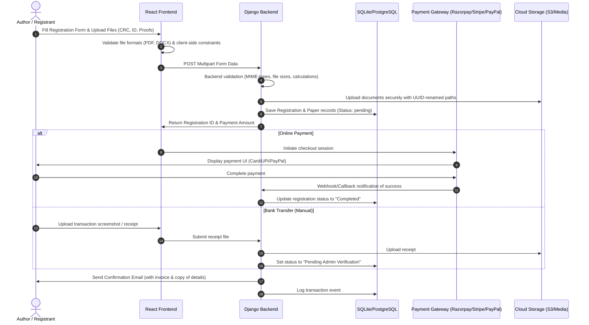

# ICCDS-2026 Registration Portal & Payment Gateway Integration

This plan outlines the architecture, database schema, upload management, encryption, and payment flow design to integrate a complete paper registration portal and payment gateway into the IEEE-CS site.

---

## User Review Required

> [!IMPORTANT]
> **Indian vs. Foreign Author Payments**
> Indian authors pay in INR, whereas Foreign authors pay in USD. Different payment gateways will be integrated:
> - **Razorpay / UPI / NetBanking**: Best for Indian authors (INR).
> - **PayPal / Stripe**: Best for Foreign authors (USD).
>
> We propose utilizing **Stripe** or **PayPal** for international payments, and **Razorpay** or **Manual Bank Transfer** (with receipt upload) for local payments.

> [!WARNING]
> **File Storage in Production**
> Large files (PDFs, DOCX, Images) should not be stored directly on the Django server filesystem in production because web hosting platforms (like Vercel, Heroku, etc.) have ephemeral file systems or disk space limits.
> We propose using **AWS S3** or **Google Cloud Storage** for storing documents. For local development, we will use Django's local `media` storage.

---

## Open Questions

> [!IMPORTANT]
> 1. Which payment gateway accounts do you already have or plan to open? (e.g. Razorpay, PayPal, Stripe, or purely manual Bank Transfer receipt uploads?)
> 2. Should authors be allowed to upload their Camera Ready Copy (CRC) and Copyright forms *directly* inside this registration form, or will they submit files separately (e.g., via email or a different page)?
> 3. Do you have a cloud storage provider (like AWS S3) available for production, or should we set up a local filesystem media storage structure as a default?

---

## Technical Stack & Architecture

- **Frontend**: React 19.x SPA + Vite 7.x + Vanilla CSS (Aesthetic glassmorphism UI styled in Outfit/Inter typography).
- **Backend**: Django 6.0.x + SQLite (Local Dev) / PostgreSQL (Recommended for production).
- **File Uploads**: Django FileSystem / AWS S3 via `django-storages` + `boto3`.
- **Encryption**: TLS 1.3 for transit, Django's default secure cryptographic tools (`django.core.signing` / hashing) and field-level encryption for sensitive info if required.

---

## Flow Plan for the Registration Process



---

## Proposed Changes

### Component 1: Django Backend

#### [NEW] [models.py](file:///d:/iccds/website/IEEE-CS_Site/backend/registration/iccds_models.py)
We will introduce models to capture ICCDS paper submissions, author registrations, and payments.

```python
import uuid
import os
from django.db import models
from django.utils.text import slugify

def get_iccds_upload_path(instance, filename):
    """Generates a secure, obfuscated path for uploaded documents."""
    ext = filename.split('.')[-1]
    # Unique name using UUID to avoid file collisions and scraping
    unique_filename = f"{uuid.uuid4()}.{ext}"
    # Structure: media/iccds2026/<registration_id>/
    return os.path.join('iccds2026', str(instance.id), unique_filename)

class ICCDSPaper(models.Model):
    id = models.UUIDField(primary_key=True, default=uuid.uuid4, editable=False)
    paper_id = models.CharField(max_length=50, unique=True, help_text="Easy Chair / CMT Paper ID")
    title = models.CharField(max_length=500)
    abstract = models.TextField(blank=True, null=True)
    
    # Camera Ready Files
    crc_pdf = models.FileField(upload_to=get_iccds_upload_path, help_text="Camera Ready Copy PDF")
    crc_docx = models.FileField(upload_to=get_iccds_upload_path, help_text="Camera Ready Copy DOCX")
    
    # Signed Copyright
    copyright_form = models.FileField(upload_to=get_iccds_upload_path, help_text="Signed IEEE Copyright Form")
    
    created_at = models.DateTimeField(auto_now_add=True)

    def __str__(self):
        return f"Paper #{self.paper_id}: {self.title[:50]}"

class ICCDSRegistration(models.Model):
    CATEGORY_CHOICES = [
        ('ieee_student', 'IEEE Member - Student'),
        ('ieee_academic', 'IEEE Member - Academic / Industry'),
        ('ieee_listener', 'IEEE Member - Listener'),
        ('non_ieee_student', 'Non-IEEE Member - Student'),
        ('non_ieee_academic', 'Non-IEEE Member - Academic / Industry'),
        ('non_ieee_listener', 'Non-IEEE Member - Listener'),
    ]
    
    CURRENCY_CHOICES = [
        ('INR', 'Indian Rupee (INR)'),
        ('USD', 'US Dollar (USD)'),
    ]

    STATUS_CHOICES = [
        ('pending_payment', 'Pending Payment'),
        ('pending_verification', 'Pending Admin Verification (Bank Transfer)'),
        ('completed', 'Completed'),
        ('failed', 'Failed'),
    ]

    id = models.UUIDField(primary_key=True, default=uuid.uuid4, editable=False)
    paper = models.ForeignKey(ICCDSPaper, on_delete=models.CASCADE, related_name='registrants', blank=True, null=True)
    
    # Personal Info
    name = models.CharField(max_length=250)
    email = models.EmailField()
    phone = models.CharField(max_length=20)
    institution = models.CharField(max_length=300)
    country = models.CharField(max_length=100)
    
    # Registration Info
    category = models.CharField(max_length=30, choices=CATEGORY_CHOICES)
    currency = models.CharField(max_length=3, choices=CURRENCY_CHOICES)
    fee_amount = models.DecimalField(max_digits=10, decimal_places=2)
    
    # Proof Uploads
    ieee_id_card = models.CharField(max_length=100, blank=True, null=True, help_text="IEEE Membership ID")
    ieee_proof = models.FileField(upload_to=get_iccds_upload_path, blank=True, null=True, help_text="IEEE Card Scan")
    student_proof = models.FileField(upload_to=get_iccds_upload_path, blank=True, null=True, help_text="Student ID Scan")
    
    # Payment status
    status = models.CharField(max_length=30, choices=STATUS_CHOICES, default='pending_payment')
    payment_method = models.CharField(max_length=50, blank=True, null=True) # razorpay, stripe, paypal, bank_transfer
    payment_receipt = models.FileField(upload_to=get_iccds_upload_path, blank=True, null=True, help_text="Bank Transfer Receipt Screen")
    transaction_id = models.CharField(max_length=250, blank=True, null=True)
    
    created_at = models.DateTimeField(auto_now_add=True)
    updated_at = models.DateTimeField(auto_now=True)

    def __str__(self):
        return f"{self.name} ({self.get_category_display()})"
```

#### [NEW] [iccds_views.py](file:///d:/iccds/website/IEEE-CS_Site/backend/registration/iccds_views.py)
This view handles:
1. Validating form fields and uploaded file parameters (size, extension).
2. Creating `ICCDSPaper` and `ICCDSRegistration` entries.
3. Managing manual/online payment requests.

#### [MODIFY] [urls.py](file:///d:/iccds/website/IEEE-CS_Site/backend/registration/urls.py)
Register endpoints:
- `POST /api/iccds/register/` (Form submission + uploads)
- `POST /api/iccds/payment/callback/` (Webhooks from Razorpay/Stripe)

---

### Component 2: Frontend (React)

#### [NEW] [RegistrationForm.jsx](file:///d:/iccds/website/IEEE-CS_Site/src/iccds2026/components/RegistrationForm.jsx)
A dynamic step-by-step registration form:
- **Step 1: Participant Details** (Name, Email, Category selection).
- **Step 2: Paper Submission Details** (Paper ID, Title, upload CRC PDF, CRC DOCX, Copyright PDF).
- **Step 3: Document Proofs** (IEEE card upload or Student ID upload, based on category).
- **Step 4: Payment Summary & Gateway Checkout** (Dynamic fee calculation, Razorpay integration overlay or Bank Account transfer instructions with screenshot upload).

#### [MODIFY] [ICCDSRegistration.jsx](file:///d:/iccds/website/IEEE-CS_Site/src/iccds2026/ICCDSRegistration.jsx)
Integrate the `RegistrationForm` component directly into the bank details/form container, replacing the "Registration Will Open Soon" notice.

---

## Security & Document Collection Best Practices

### 1. Document Collection and Storage
- **Local Dev vs. Prod**: In development, files will be saved in `d:\iccds\website\IEEE-CS_Site\backend\media`. In production, we will configure Django's `DEFAULT_FILE_STORAGE` to connect to **AWS S3** or **Azure Blob Storage** via `django-storages`.
- **Security & Privacy**:
  - Upload paths use UUIDs to guarantee that files cannot be scraped or accessed by guessing sequence IDs.
  - On the backend, verify files by checking their extension and magic bytes (MIME type check) to prevent uploading malicious executable files.
  - Limit file upload size to a maximum of 10MB per file to avoid server resource exhaustion.

### 2. Encryption
- **Data in Transit**: HTTPS/TLS 1.3.
- **Sensitive Data**: Payment API keys, credentials, and email SMTP keys are loaded securely from `.env` environment variables.
- **Database Security**: Standard Django user authentication & access controls. Django DB password fields are automatically hashed using PBKDF2 with a SHA256 HMAC.

---

## Verification Plan

### Automated Tests
- Test API validation for fields, categories, and payment statuses.
- Unit tests to verify file size checks, extension filters, and fee calculations.

### Manual Verification
- Render the React frontend, verify file uploads, check state dynamics, and ensure CORS requests route through Vite's local dev proxy successfully.
- Verify payment gateway callback flow using sandbox credentials (Razorpay Test Mode / Stripe Test Keys).
